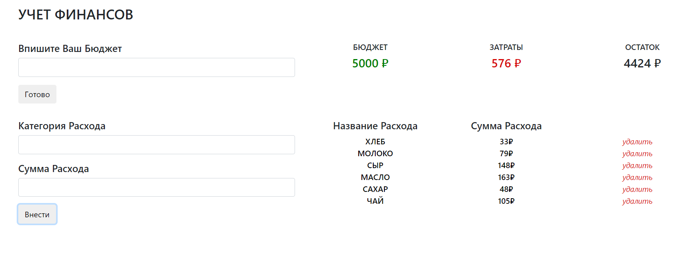

# Отчет

Приложение: учёт финансов  
Выполнила: Романадзе Екатерина  
Группа: М8О-111М-20

## Функионал

* Можно обозначить бюджет
* Есть возможность внести список затрат, указав категорию
* Внесенные затраты можно удалять
* После каждой операции пересчитывается остаток денежных средств

## Макет приложения 

